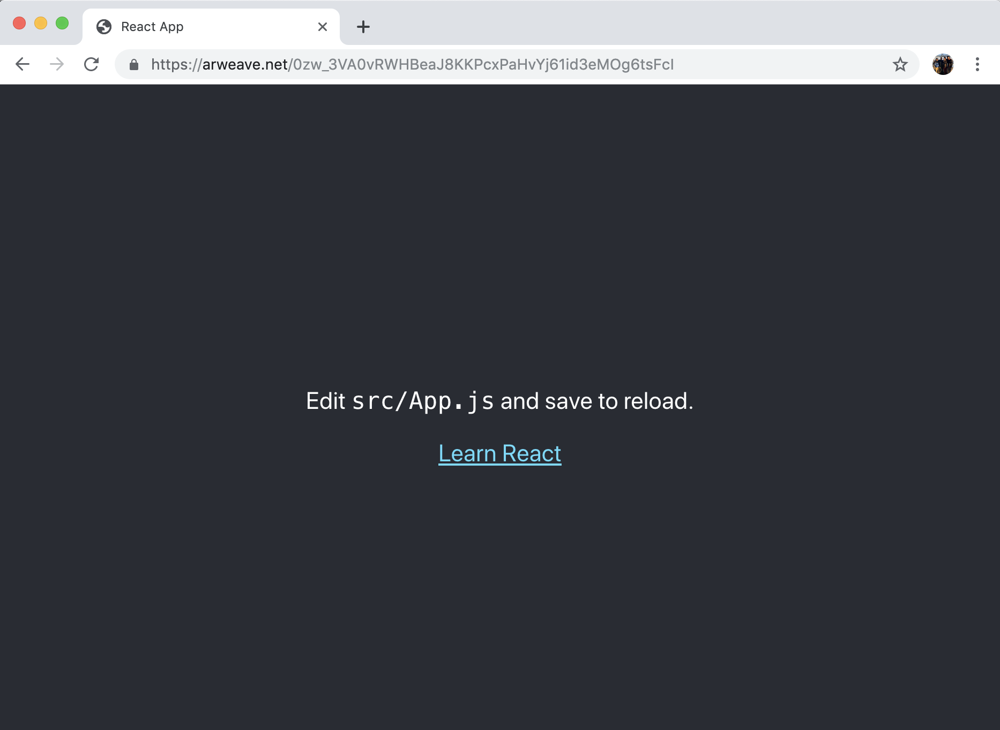

# airweave test

## 1 | Description 

Testing React app deployment on the AR Weave hosting blockchain platform. Meant for deploying to the AR permaweb. 

Example deployment found here: 



## 2 | Instructions

### 2.2 Ready the build

Install dependencies and build the project.

```
cd client
npm install
npm run build
```

In the build folder, in `index.html` set the absolute paths to relative paths. 

Example

```
<script src="/static/js/main.2ae83226.chunk.js"></script>

// to

<script src="./static/js/main.2ae83226.chunk.js"></script>

```

Using this fix, imported images may not be supported. 

Check your project by opening `index.html` inside the build directory.

### 2.3 Ready your AR account

Create an AR wallet with AR. Wallet creation address is . This should provide you with a json file. 

### 2.4 Install the AR CLI

Install the CLI

```
npm install -g arweave-deploy
```

### 2.5 Use the AR CLI to Deploy your build

Load your AR json wallet file to the AR CLI.

```
arweave key-save path/to/arweave-key.json
```

Now you can run deploy commands without passing your key each time. 


Test packaging your React app build.

```
arweave package path-to/index.html packaged.html
```

If packaged.html renders as intended, deploy to the AR permaweb. 

```
arweave deploy path-to-my/index.html --package
```

Example deployment found here: 